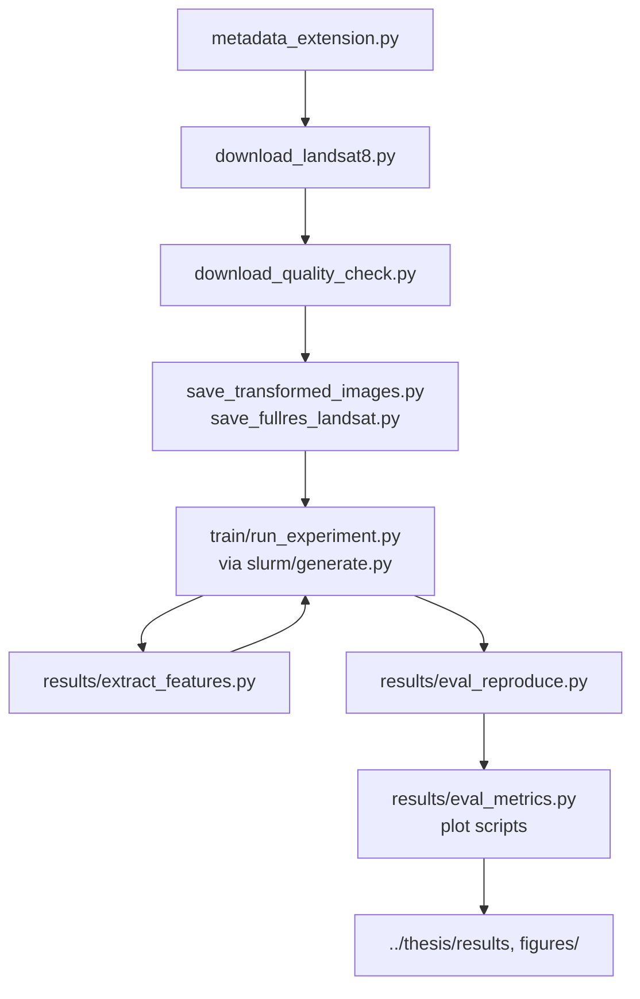

# Seeing the Big Picture

This repository contains code and data pipeline for the master's thesis:  
> **"Seeing the Big Picture: Exploring the Effects of Context Fusion in Earth Observation"**  

Author: Erik Henicke  
Written at: Computer Vision Group, FSU Jena  
Supervisors: M.Sc. Moien Rangzan and M.Sc. Ihab Asaad  

## 1. About

In this thesis we study whether wide-extent, low-resolution satellite context improves land-use classification under geographic distribution shift through the FMoW-WILDS dataset. We therefore pair each high-resolution (HR) image with a low-resolution (LR) Landsat image that covers $15 \times 15$ km around the sample's location. Our models fuse both inputs, and we evaluate them on in-distribution (ID) and out-of-distribution (OOD) test data.

todo: Regions follow the WILDS index: 0 Asia, 1 Europe, 2 Africa, 3 Americas, 4 Oceania, 5 Other.

## 2. Repository map


| Path | Contents |
| --- | --- |
| `src/dataset/` | `FMoWMultiScaleDataset`: pairs each FMoW-WILDS HR image with its Landsat GeoTIFF. Serves raw images, preprocessed tensors, or cached features. Also provides spatial-encoding tensors, the leave-Asia-out split, and the LR crop for the extent study. |
| `src/dataset_creation/` | Scripts that build the paired dataset: metadata, Landsat download, quality check, statistics, preprocessing, inspection. |
| `src/models/` | Model code. `multi_scale_classification.py` is the Lightning training/eval harness. `components/` holds encoders (`branches.py`), fusion modules (`fusion.py`), full architectures (`fusion_models.py`), D3G domain relations, and Fourier spatial encoding. |
| `src/train/` | `run_experiment.py` (Hydra entrypoint) and the config tree `configs/`. |
| `src/slurm/` | `generate.py` renders sbatch scripts from `configs/run/*.yaml`. Generated scripts land in subfolders here. |
| `src/results/` | Evaluation and export: re-evaluation, feature extraction, result tables, plots. |
| `src/statistics/` | Per-class spatial-extent statistics. |
| `src/playground/` | One-off inspection scripts. Not part of the pipeline. |
| `lib/` | Git submodules: `satclip`, `dinov3`, `wilds-geoshift`. |
| `data/` | Local FMoW data root (WILDS `fmow_v1.1/`, original fMoW `groundtruth/` metadata, `rgb_metadata_extended.csv`, caches). |
| `log/` | `log/slurm/` (job output) and `log/runs/<date>/<run_name>-<time>/` (checkpoints, metrics). |
| `results/`, `figures/` | Generated HTML tables and figures. |

### 2.1 Thesis Workflow 



## 3. Data

### 3.1 FMoW and FMoW-WILDS

We use the WILDS repackaging of FMoW (62 land-use classes, 224×224 RGB) for the HR branch. We load it with `wilds.get_dataset(dataset="fmow", root_dir=cfg.data.fmow_dir, download=False, split_scheme="official")`, so the WILDS layout (`fmow_v1.1/`) must already exist under `data.fmow_dir`. We read raw HR images from `<fmow_dir>/fmow_v<version>/images`.

We reconstruct the WILDS splits from the raw CSV split column plus timestamp windows (see `src/statistics/average_class_extent.py`): train 2002–2012, id_val/id_test 2002–2012, ood_val 2013–2015, ood_test 2016–2017. We exclude the FMoW `seq` split. This leaves us with 141,696 samples.

The raw fMoW-rgb bucket is public:

```shell
aws s3 ls --no-sign-request s3://spacenet-dataset/Hosted-Datasets/fmow/fmow-rgb/
aws s3 cp --no-sign-request s3://spacenet-dataset/Hosted-Datasets/fmow/fmow-rgb/<split>/<category>/ .
```

`metadata_extension.py` also needs the original fMoW metadata JSONs under `<fmow_dir>/groundtruth/<split>/<category>/<category>_<idx>/….json`.

### 3.2 Landsat-8 extension

We build the LR branch in two steps, both in `src/dataset_creation/`:

1. With **`metadata_extension.py`** we compute each sample's center coordinates and ground span (degrees/km) from the original fMoW bounding boxes. Output: `rgb_metadata_extended.csv` (written to the hardcoded `DEST_DIR`, `/home/datasets4/FMoW_LandSat/fmow_landsat`).
2. With **`download_landsat8.py`** we download one Landsat median composite per WILDS sample from Google Earth Engine. Region of interest: 3× the HR span (`EXTENSION_FACTOR = 3.0`), 30 m scale, EPSG:3857. We QA-mask the scenes and scale them from DN to surface reflectance. The script widens the date window step by step and falls back from Landsat 8 to Landsat 5/7 until at least `MIN_COL_SIZE = 50` scenes are found. Output: `image_<sample_idx>.tif` under `<DATA_DIR>/images`, plus `rgb_metadata_download.csv` with the collection and date range used per sample. Downloads run in parallel (pandarallel, 20 workers) and append to an existing download by default.

**Google authentication:** the script calls `ee.Authenticate()` (interactive Google login) and then `ee.Initialize(project='seeing-the-big-picture')`. You need a Google account with Earth Engine access and your own GEE-enabled Google Cloud project. Replace `EE_PROJECT_NAME` with your project.

**Checks:** with `download_quality_check.py` we verify that every WILDS index has a GeoTIFF and flag images with too many zero/masked/NaN pixels (`quality_check.log`). `translate_geotiff_to_png.py` converts GeoTIFFs to PNGs for visual inspection.

### 3.3 Preprocessing and normalization

- With `compute_stats.py` we compute per-channel mean/std over the raw RGB and Landsat images (Welford's algorithm).
- We hardcode these statistics in `FMoWMultiScaleDataset.get_default_transform_rgb/…_landsat` and select them with `image_norm="fmow-statistics"`. Other options: `const` (0.5/0.5) for RGB, ImageNet statistics as RGB fallback, and a theoretical DN(0–65353)→reflectance scaling as Landsat fallback. `check_image_stats.py` verifies value ranges.
- With `save_transformed_images.py` we apply the transforms once and cache both branches as normalized tensors: `<output_dir>/fmow_preprocessed/{fmow_rgb,landsat}/`, files `rgb_img_<id>.pt` / `image_<id>.pt`. `<id>` is the row index of `rgb_metadata_extended.csv`. We cache only WILDS rows.
- For the extent study we additionally cache the Landsat branch at its native 497×497 resolution (fp16) with `save_fullres_landsat.py`. We crop this cache to `data.lr_crop_km` and resize to 224 at load time. The standard 224 cache cannot be re-cropped.

### 3.4 Data locations and host resolution

This is the main thing to understand before running anything. In our configs, `data.preprocessed_dir` is a directory **name**, not a path. `_host_data_root()` (in `src/dataset/fmow_multiscale_dataset.py`) maps the hostname to a data root:

| Host | Data root |
| --- | --- |
| gaia4, gaia5, gaia6, gaia7 | `/data/henicke` |
| nyx | `/home/nyx_data1/henicke` |
| gaia1 | `/users/henicke` |
| kallisto, io | `/home/datasets4/FMoW_LandSat` |

Unknown hosts raise a `ValueError`.

A run with `data.source=preprocessed` expects `<data_root>/<preprocessed_dir>/fmow_preprocessed/{fmow_rgb,landsat}/` on the node it runs on, so we copy the caches to each compute host's data root. Our run YAMLs pick caches by name: `FMoW_LandSat`, `FMoW_LandSat_Norm`, and `FMoW_LandSat_` (constant 0.5 normalization, per comments in `configs/run/feature_fusion.yaml`).

Cached features (section 5.3) follow the same rule: `<data_root>/FMoW_LandSat_<Run-Name>_Features/run<i>/fmow_features/{fmow_rgb,landsat}/`.

## 4. Setup

- We use Python 3.12 (`.python-version`) and manage the project with **uv**: dependencies are declared in `pyproject.toml` and pinned in `uv.lock`. On Linux/Windows, torch comes from the PyTorch `cu118` wheel index. `lightning` is pinned to 2.6.1.
- We run all commands through `uv run`, which installs the locked environment on demand. Training and most result scripts need `--env-file .env`; `.env` sets `PYTHONPATH=src`.
- Initialize the submodules in `lib/` (`git submodule update --init`). `satclip` and `wilds-geoshift` use SSH URLs.
- Pretrained weights download at runtime from Hugging Face Hub, timm, and torchvision: DINOv3 (`facebook/dinov3-vitb16-pretrain-lvd1689m`, `facebook/dinov3-vitl16-pretrain-sat493m`) and SatCLIP (`microsoft/SatCLIP-ViT16-L10`). First use needs network access and any required Hugging Face login.
- Weights & Biases is required: `run_experiment.py` calls `wandb.login()`, and we log to the project `fmow`. There is no offline mode in the code.
- `ENV.md` holds legacy conda notes. It ends with "Use uv instead."

## 5. Running experiments

### 5.1 Configuration

Our Hydra configs live in `src/train/configs/`:

- `setup.yaml` composes the defaults: `data=fmow_multiscale`, `spatial=no_spatial`, `optim=adamw_plateau`, `trainer=default`, `wandb=fmow`, plus a `model`. Globals: `num_task_labels: 62`, `seed: 111`, `num_reruns: 3`. Run dir: `log/runs/<YYYY-MM-DD>/<run_name>-<HH-MM-SS>`.
- `model/*.yaml` selects architecture and backbone via `_target_` classes: single-branch baselines, `*_stacked` (early fusion), `*_{concat,film,geoprior,multsim,d3g}` (feature fusion), `*_le_*` (location encoder), `*_de_*` (domain embedding), `*_decision_fusion`.
- `spatial/*.yaml` toggles coordinate channels (`pe`), Fourier encoding (`pe_freq`, HR-only variants `*_hr`), and overlap masks (`om_bin`, `om_gauss`), plus combinations.
- `trainer/default.yaml`: 50 epochs, checkpoint on `val/val-od-worst-group-task-acc`, best-run metric `test/test-od-worst-group-task-acc`.
- `run/*.yaml` are **not** Hydra configs. Each defines an experiment matrix for the SLURM generator: `slurm:` resources, `global_overrides:`, and `experiments:` (key → `model` + `overrides`).
- `eval/*.yaml` drive the result scripts (section 6). `eval/translations.yaml` maps metric and model keys to display names.

### 5.2 Direct runs and SLURM

Direct:

```shell
uv run --env-file .env src/train/run_experiment.py model=<model-config> [key=value ...]
```

SLURM:

```shell
uv run python src/slurm/generate.py src/train/configs/run/<run>.yaml
```

Without an argument, the script prompts for a run YAML. It writes one script per experiment to `src/slurm/<run>/train_<key>.sh` (defaults: partition `robolab`, nodelist `gaia4,gaia7`, 1 GPU, 4 CPUs, 8G per CPU, output in `log/slurm/`). Each script `cd`s to the repo root and runs `srun uv run --env-file .env src/train/run_experiment.py model=<model> <overrides> run_name=train_<key>`. Submit with `sbatch`.

One invocation runs `num_reruns` (default 3) seeded reruns in sequence. All reruns share the W&B group `<run_name>-<timestamp>`; runs are named `…-run<i>`. Checkpoints (best + last) go to `<run_dir>/checkpoints/run<i>`. The best checkpoint is used for the test pass. Frozen decision-fusion models skip training and only test.

### 5.3 Feature extraction and decision fusion

We train and evaluate decision fusion on cached encoder features instead of images:

```shell
uv run --env-file .env src/results/extract_features.py <run_dir> [--batch-size N] [--overwrite]
```

The script loads every seed checkpoint of a finished single-branch run and pushes all splits through the frozen encoder in eval mode (deliberate: cached features must be deterministic). HR runs write `fmow_rgb` features; LR and location runs write `landsat` features. Output path: see section 3.4.

Our decision-fusion runs then set `data.source=features` and name the source runs via `data.hr_feature_run_name` / `data.lr_feature_run_name`. Rerun `i` loads the features of seed `i`. `DecisionFusionModel` also rebuilds its two classifier heads from the source runs' checkpoints, resolved by experiment key (newest `log/runs/*/train_<key>-*`). With `model.train_model=true` the heads are retrained jointly instead of frozen.

## 6. Evaluation and results

**Where metrics live.** Each rerun writes `log/runs/<date>/<run_name>-<time>/run<i>/version_0/metrics.csv` (Lightning CSVLogger); the same metrics go to W&B. With `eval_reproduce.py` we re-evaluate each seed checkpoint on the OOD and ID test splits, check the values against training, and write an extended set (per-class, top-5) to `metrics_rerun.csv` next to the original, plus per-sample logits to `logits_rerun.npz`. All loaders prefer `metrics_rerun.csv` over `metrics.csv`.

**Tables.**

```shell
uv run --env-file .env src/results/eval_metrics.py src/train/configs/eval/<eval>.yaml [--latex | --both]
```

The script resolves each run reference (`<exp_key>` or `<run_yaml>@<exp_key>`) to its newest log directory, averages metrics over seeds, and writes one table per group: HTML to `results/<eval_name>/`, LaTeX to `../thesis/results/<eval_name>/`. Best and second-best values per column are highlighted. LaTeX output also rebuilds a combined standalone document.

**Plots.** `eval_classes.py` (per-class deltas, to `figures/<eval_name>/`), `region_fusion_plot.py` (per-region deltas, written to this repo and the thesis repo), `decision_plots.py`, `spatial_extent_plots.py`, `per_seed_compare.py` (per-seed values, printed).

## 7. Experiment catalog

| Run YAML (`configs/run/`) | Studies | Eval YAML | Thesis output |
| --- | --- | --- | --- |
| `baselines.yaml` | Single-branch HR/LR/location baselines, backbone selection (DenseNet, DeiT, EfficientNet, EfficientFormer, DINOv3), SatCLIP location fusion, domain-embedding fusion | `eval/baselines.yaml` | `../thesis/results/baselines/` |
| `early_fusion.yaml` | Channel stacking (HR+LR in one encoder), LR-channel init (default/zero/he), domain loss on/off, DINOv3 | `eval/early_fusion.yaml` | `../thesis/results/early_fusion/` |
| `feature_fusion.yaml` | Fusion modules (Concat, FiLM, GeoPrior, MultSim, D3G), gradient-detach ablations, domain loss on/off, normalization/label-smoothing/ReLU ablations, spatial encodings, DINOv3 | `eval/feature_fusion.yaml` | `../thesis/results/feature_fusion/` |
| `decision_fusion.yaml` | Decision rules (sum, max, min, GeoPrior/product) with prior/domain ablations, frozen vs. jointly trained heads, DenseNet and DINOv3 | `eval/decision_fusion.yaml` | `../thesis/results/decision_fusion/` |
| `spatial_extent.yaml` | LR extent sweep (`lr_crop_km` 1–14.9 km) for FiLM and D3G, plus an RGB-bands-only ablation | `eval/spatial_extent.yaml` | `../thesis/results/spatial_extent/` |
| `leave_asia_out.yaml` | Leave-Asia-out generalization for the best baseline/FiLM/D3G/location configs | `eval/leave_asia_out.yaml` | `../thesis/results/leave_asia_out/` |
| `late_fusion.yaml` | Early exploration (baselines, domain-loss and dimension sweeps); superseded, its eval YAML is parked as `eval/late_fusion.yaml.bak` | — | — |

## 8. Known issues and caveats

**Reproducibility of numbers.** We seed each rerun with `seed_everything(cfg.seed + run_idx, workers=True)` from base seed 111, so the default reruns use seeds 111/112/113, including DataLoader workers and augmentation (shared random flips). We force evaluation to be deterministic: eval mode plus `cudnn.deterministic = True` during test epochs (also set in `eval_reproduce.py`, `extract_features.py`, `retrain_lr_domain.py`). Training is **not** bit-reproducible: it keeps the default non-deterministic cuDNN algorithms, and the Trainer does not set `deterministic=True`. A `set_float32_matmul_precision("medium")` call exists but is commented out, so matmul precision stays at the PyTorch default. Results also vary with GPU model and library versions.

**Blockers for outside reproduction:**

1. `pyproject.toml` requires `ee>=0.2`, which resolves to an unrelated 2014 PyPI package — not Google's Earth Engine client (`earthengine-api`). As locked, the environment cannot run `download_landsat8.py`.
2. `setup.yaml` defaults to `model: deit_both`, which does not exist in `configs/model/`. Always pass `model=<…>` explicitly.
3. Obtaining FMoW-WILDS is not scripted (`download=False`). The AWS commands above cover only the raw fMoW-rgb bucket, not the WILDS `fmow_v1.1` layout or the `groundtruth/` metadata JSONs.

**Environment assumptions:**

4. Hardcoded paths: `data.fmow_dir` defaults to `/home/henicke/data`, `data.landsat_dir` to `/home/datasets4/FMoW_LandSat`; `metadata_extension.py` and `download_landsat8.py` hardcode their directories; `_host_data_root()` only knows the hosts in section 3.4.
5. The Earth Engine project name `seeing-the-big-picture` belongs to the author. Use your own.
6. W&B credentials are required; there is no offline fallback.

**Minor:**

7. The normalization baked into each preprocessed cache (`FMoW_LandSat`, `FMoW_LandSat_Norm`, `FMoW_LandSat_`) is documented only in run-YAML comments; the caches carry no manifest.
8. `lib/wilds-geoshift` is a declared submodule but is never imported under `src/`.
9. `run_experiment.py`'s module docstring says "two fixed reruns"; the code runs `range(num_reruns)` (default 3). The code is authoritative.
